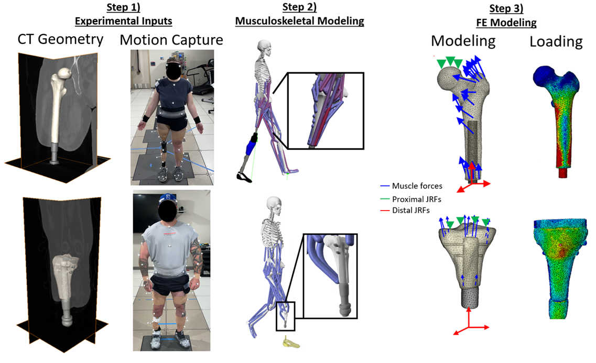

# Finite Element Analysis of Bone-Anchored Limbs
## Standard Operating Procedure

This document provides details of how to create and analyze finite element models of the residual limb of individuals with ___bone-anchored limbs___ (BALs). Instructions for designing a finite-element (FE) model of the residual limb prosthetic anatomy, finite element analysis (FEA) of the FE model, and determination of stresses are given. This method requires running a preliminary musculoskeletal (MSK) model in OpenSim to determine patient-specific muscle and joint force vectors throughout the task of interest. These forces are applied to the designed FE model to determine a temporal view of stresses over time. 

### The overall process has eight steps:

- **Step Zero: Pre-start checklist**
- **Step One: Determination of joint and muscle vectors**
- **Step Two: Image Registration**
- **Step Three: Image Segmentation**
- **Step Four: Positioning the Femur and Adding PMMA: Stance and Fall**
- **Step Five: Building the FE Meshes**
- **Step Six: Preliminary Finite Element Analysis**
- **Step Seven: Add elastic-perfectly plastic material properties to bone elements**
- **Step Eight: Final Finite Element Analysis**

